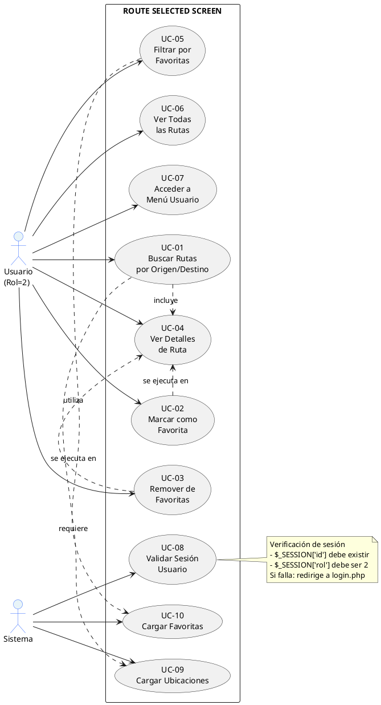

## DIAGRAMA DE CASOS DE USO - ROUTE SELECTED SCREEN (PlantUML)




═══════════════════════════════════════════════════════════════════

CASOS DE USO PRINCIPALES:

┌─────────────────────────────────────────────────────────────┐
│ 1. BUSCAR RUTAS                                               │
├─────────────────────────────────────────────────────────────┤
│ Actor: Usuario (Conductor/Pasajero - rol=2)                │
│ Descripción: Permite al usuario buscar rutas según          │
│              origen y destino seleccionados                 │
│ Pasos:                                                       │
│   1. Usuario selecciona ubicación de origen                │
│   2. Usuario selecciona ubicación de destino               │
│   3. Sistema habilita botón "Buscar"                       │
│   4. Usuario hace clic en "Buscar"                         │
│   5. Sistema obtiene rutas disponibles de la API           │
│   6. Sistema muestra lista de rutas encontradas            │
│ Resultado: Lista de rutas que coinciden con búsqueda       │
└─────────────────────────────────────────────────────────────┘

┌─────────────────────────────────────────────────────────────┐
│ 2. VER DETALLES DE RUTA                                      │
├─────────────────────────────────────────────────────────────┤
│ Actor: Usuario (Conductor/Pasajero - rol=2)                │
│ Descripción: Permite ver información detallada de una ruta  │
│              seleccionada                                   │
│ Pasos:                                                       │
│   1. Usuario hace clic en una tarjeta de ruta               │
│   2. Sistema marca la ruta como seleccionada                │
│   3. Sistema muestra en columna derecha:                   │
│      - Trayecto completo (origen → destino)                 │
│      - Información de la empresa                            │
│      - Teléfono de la empresa                              │
│      - Email de la empresa                                 │
│      - Horarios (con días y horas salida/llegada)         │
│      - Paradas intermedias                                 │
│      - Información del conductor                            │
│      - Información del vehículo                             │
│ Resultado: Visualización completa de detalles de ruta       │
└─────────────────────────────────────────────────────────────┘

┌─────────────────────────────────────────────────────────────┐
│ 3. AGREGAR RUTA A FAVORITAS                                  │
├─────────────────────────────────────────────────────────────┤
│ Actor: Usuario (Conductor/Pasajero - rol=2)                │
│ Descripción: Permite guardar una ruta en favoritas          │
│ Pasos:                                                       │
│   1. Usuario hace clic en icono de corazón (♡)              │
│   2. Sistema realiza solicitud POST a API de favoritas     │
│   3. API almacena la ruta como favorita para el usuario    │
│   4. Icono de corazón cambia a rojo y lleno (♥)             │
│ Resultado: Ruta guardada en lista de favoritas              │
└─────────────────────────────────────────────────────────────┘

┌─────────────────────────────────────────────────────────────┐
│ 4. REMOVER RUTA DE FAVORITAS                                │
├─────────────────────────────────────────────────────────────┤
│ Actor: Usuario (Conductor/Pasajero - rol=2)                │
│ Descripción: Permite eliminar una ruta de favoritas         │
│ Pasos:                                                       │
│   1. Usuario hace clic en icono de corazón lleno (♥)        │
│   2. Sistema realiza solicitud DELETE a API de favoritas   │
│   3. API elimina la ruta de favoritas del usuario          │
│   4. Icono de corazón cambia a gris y vacío (♡)            │
│ Resultado: Ruta removida de lista de favoritas              │
└─────────────────────────────────────────────────────────────┘

┌─────────────────────────────────────────────────────────────┐
│ 5. FILTRAR POR FAVORITAS                                     │
├─────────────────────────────────────────────────────────────┤
│ Actor: Usuario (Conductor/Pasajero - rol=2)                │
│ Descripción: Muestra solo las rutas que usuario ha marcado  │
│              como favoritas                                 │
│ Pasos:                                                       │
│   1. Usuario hace clic en botón "Mis Favoritas"             │
│   2. Sistema carga lista de favoritas de la API            │
│   3. Sistema filtra y muestra solo rutas favoritas         │
│   4. Los demás casos de uso funcionan normalmente           │
│ Resultado: Vista filtrada con solo rutas marcadas favoritas │
└─────────────────────────────────────────────────────────────┘

┌─────────────────────────────────────────────────────────────┐
│ 6. VER TODAS LAS RUTAS                                       │
├─────────────────────────────────────────────────────────────┤
│ Actor: Usuario (Conductor/Pasajero - rol=2)                │
│ Descripción: Muestra el listado completo sin filtros        │
│ Pasos:                                                       │
│   1. Usuario hace clic en botón "Ver Todas"                 │
│   2. Sistema recarga todas las rutas disponibles            │
│   3. Sistema limpia el filtro de favoritas                  │
│ Resultado: Listado completo de rutas                        │
└─────────────────────────────────────────────────────────────┘

┌─────────────────────────────────────────────────────────────┐
│ 7. ACCEDER AL MENÚ DE USUARIO                               │
├─────────────────────────────────────────────────────────────┤
│ Actor: Usuario (Conductor/Pasajero - rol=2)                │
│ Descripción: Acceso a opciones de usuario                   │
│ Pasos:                                                       │
│   1. Usuario hace clic en icono de perfil (usuario)         │
│   2. Se despliega menú con opciones:                       │
│      - Ver sitio web principal (goway.netlify.app)         │
│      - (Otras opciones configurables)                       │
│ Resultado: Menú desplegable con opciones disponibles        │
└─────────────────────────────────────────────────────────────┘

┌─────────────────────────────────────────────────────────────┐
│ 8. VALIDAR SESIÓN DE USUARIO                                │
├─────────────────────────────────────────────────────────────┤
│ Actor: Sistema                                              │
│ Descripción: Verifica que usuario está autenticado          │
│ Pasos:                                                       │
│   1. Sistema verifica $_SESSION['id'] existe                │
│   2. Sistema verifica $_SESSION['rol'] == 2                 │
│   3. Si fallan: redirige a login.php                       │
│   4. Si pasan: carga página normalmente                    │
│ Resultado: Acceso permitido o redireccionamiento a login   │
└─────────────────────────────────────────────────────────────┘


═══════════════════════════════════════════════════════════════════

DIAGRAMA DE FLUJO DE INTERACCIONES:

                                INICIO
                                  │
                                  ▼
                        ┌─────────────────┐
                        │Verificar Sesión │
                        │   (rol=2)       │
                        └────────┬────────┘
                                 │
                    ┌────────────┴────────────┐
                    │                         │
                   NO                        SÍ
                    │                         │
                    ▼                         ▼
            ┌──────────────┐       ┌──────────────────┐
            │ Redirigir a  │       │   Cargar Página  │
            │   login.php  │       │   (Componentes)  │
            └──────────────┘       └────────┬─────────┘
                    │                       │
                    │                       ▼
                    │            ┌──────────────────┐
                    │            │ Cargar Ubicaciones│
                    │            │     (API)        │
                    │            └────────┬─────────┘
                    │                     │
                    │                     ▼
                    │            ┌──────────────────┐
                    │            │ Cargar Favoritas │
                    │            │      (API)       │
                    │            └────────┬─────────┘
                    │                     │
                    │                     ▼
                    │            ┌──────────────────┐
                    │            │ Mostrar Interfaz │
                    │            │  (Esperando uso) │
                    │            └────────┬─────────┘
                    │                     │
                    │         ┌───────────┼───────────┐
                    │         │           │           │
                    │         ▼           ▼           ▼
                    │    ┌──────┐  ┌──────┐  ┌──────┐
                    │    │Buscar│  │Filtro│  │♡/♥ │
                    │    │Rutas │  │Fav.  │  │Marcar│
                    │    └──────┘  └──────┘  └──────┘
                    │
                    └─────────────────► FIN


═══════════════════════════════════════════════════════════════════

UBICACIÓN EN ARQUITECTURA GENERAL:

Usuario (Rol=2: Conductor/Pasajero)
        │
        ▼
  [Route Selected Screen]
        │
        ├──────────────────────────┐
        │                          │
        ▼                          ▼
   API Backend              Base de Datos
   - routes_api.php        - Rutas
   - favorites_api.php     - Favoritas
   - usuarios.php          - Usuarios
   - login.php             - Sesiones


═══════════════════════════════════════════════════════════════════

DATOS VISUALIZADOS EN DETALLES DE RUTA:

Información de Empresa:
├── Nombre
├── Teléfono
└── Email

Información de Horarios:
├── Día de operación (Lunes, Martes, etc.)
├── Hora de salida
├── Hora de llegada
├── Duración estimada del viaje
└── Paradas intermedias

Información del Conductor:
└── Datos asociados a la ruta

Información del Vehículo:
├── Placa
├── Tipo
├── Capacidad
└── Estado


═══════════════════════════════════════════════════════════════════
```

## RESUMEN DE FUNCIONALIDADES

El **Route Selected Screen** es una pantalla de búsqueda y visualización de rutas con las siguientes características principales:

### **Funciones Principales:**
1. 🔍 **Búsqueda de Rutas** - Filtrar por origen y destino
2. 💔/❤️ **Gestión de Favoritas** - Marcar/desmarcar rutas
3. 🎯 **Vista Detallada** - Información completa de cada ruta
4. 🔽 **Filtrado** - Ver todas o solo favoritas
5. 👤 **Menú de Usuario** - Acceso a opciones de cuenta

### **Elementos de Interfaz:**
- **Panel Izquierdo**: Búsqueda y lista de rutas
- **Panel Derecho**: Detalles de ruta seleccionada
- **Header**: Logo, título y menú de usuario
- **Responsivo**: Se adapta a dispositivos móviles

### **Interacciones con Backend:**
- GET ubicaciones disponibles
- GET rutas según búsqueda
- GET/POST/DELETE favoritas del usuario
- Validación de sesión en servidor
